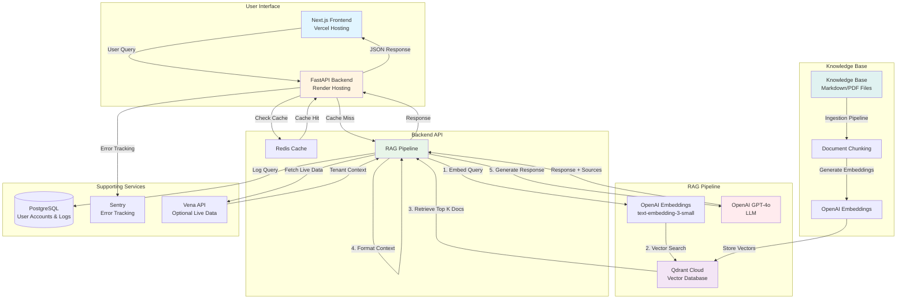

# Conversation Summary - RAG Bot Architecture & GDPR Documents

**Date:** January 2026  
**Topic:** RAG Bot Component Architecture Documentation & GDPR Compliance Review

---

## 1. GDPR Compliance Documents Review

### Documents Found in GDPR Folder:
1. **DATA_BREACH_PROCEDURES.docx** - Procedures for handling data breaches (GDPR Articles 33 & 34)
2. **DPIA_RAG_BOT.docx** - Data Protection Impact Assessment for high-risk processing
3. **LEGITIMATE_INTEREST_ASSESSMENT.docx** - Assessment for legitimate interest legal basis
4. **PRIVACY_POLICY.docx** - Privacy policy informing data subjects
5. **PROCESSOR_REGISTER.docx** - Documents third-party data processors (Article 28)
6. **ROPA_RAG_BOT.docx** - Record of Processing Activities (Article 30)
7. **DATA_SUBJECT_REQUEST_PROCEDURES.docx** - Procedures for access, deletion, portability requests

### Missing from Image (but exists in folder):
- **DATA_SUBJECT_REQUEST_PROCEDURES.docx** - Should be included in the main set

### Potentially Missing Documents:
- Data Processing Agreements (DPAs) with third-party processors (OpenAI, Qdrant, Sentry, Render, Vercel)
- Data Retention Policy (specific retention periods)
- Consent Forms/Mechanisms (if using consent as legal basis)
- Data Transfer Impact Assessment (for transfers outside EEA)
- Security Policy/Procedures

---

## 2. RAG Bot Architecture Diagram

### Complete System Flow:

```
User Query → Frontend (Next.js/Vercel)
    ↓
Backend API (FastAPI/Render)
    ↓
Check Redis Cache
    ├─ Cache Hit → Return Cached Response
    └─ Cache Miss → RAG Pipeline
        ↓
1. Embed Query (OpenAI Embeddings)
    ↓
2. Vector Search (Qdrant Cloud)
    ↓
3. Retrieve Top K Documents
    ↓
4. Format Context
    ↓
5. Generate Response (GPT-4o)
    ↓
Return Answer + Sources
    ↓
Log to PostgreSQL
Cache in Redis
```

### Components:
- **Frontend:** Next.js 15 + React 19 (Vercel) ✅ **Currently Implemented**
- **Backend:** FastAPI Python (Render/Railway) ✅ **Currently Implemented**
- **Vector DB:** Qdrant Cloud ✅ **Currently Implemented** (Note: Document mentions Pinecone/Weaviate as alternatives, but Qdrant Cloud is the production choice)
- **LLM:** OpenAI GPT-4o ✅ **Currently Implemented**
- **Embeddings:** OpenAI text-embedding-3-small ✅ **Currently Implemented**
- **Database:** PostgreSQL ✅ **Currently Implemented**
- **Cache:** Redis ✅ **Currently Implemented**
- **Monitoring:** Sentry ✅ **Currently Implemented**
- **Knowledge Base:** Markdown/PDF/Word files stored in AWS S3 with approval workflow (staging/approved/archive)
- **Authentication:** JWT-based authentication with bcrypt password hashing ✅ **Currently Implemented**
- **Document Management:** Admin UI for document approval workflow ✅ **Currently Implemented**

---

## 3. PowerPoint Presentation Content

### Slide 1: Title Slide
**FCS RAG Bot Component Architecture**
*An overview of the system components and how they work together*

---

### Slide 2: Frontend (Next.js/Vercel)

**Purpose:** User interface for the RAG bot chat application

**Technology:** 
- Next.js 15 (React framework)
- React 19 (UI library)
- TypeScript
- Tailwind CSS (styling)
- Deployed on Vercel (hosting)

**What it does:**
- Provides a ChatGPT-style chat interface where users can ask questions
- Displays bot responses with source citations in markdown format
- Handles user authentication via JWT tokens (Login button in top-right)
- Features Home/Chat/Admin tabs for navigation
- Sends API requests to the backend and displays streaming responses
- Includes features like message history, copy buttons, and feedback mechanisms
- Admin UI for document management (upload, approve, reject, archive)
- Responsive design that works on desktop and mobile devices

---

### Slide 3: Backend (FastAPI/Render)

**Purpose:** API server that processes user queries and coordinates the RAG pipeline

**Technology:**
- FastAPI (Python web framework)
- Python 3.11+
- Deployed on Render or Railway (cloud hosting)
- Uvicorn (ASGI server)

**What it does:**
- Receives HTTP requests from the frontend
- Handles authentication using JWT tokens with bcrypt password hashing
- Manages rate limiting to prevent abuse (configurable per endpoint)
- Routes queries to the RAG pipeline
- Logs all queries and responses to PostgreSQL for analytics
- Implements caching layer with Redis (24-hour TTL, configurable)
- Provides RESTful API endpoints for:
  - Query endpoints (`/api/query`)
  - Ingestion endpoints (`/api/ingest`)
  - Admin endpoints (document management, user management)
  - Authentication endpoints (`/api/auth/login`, `/api/auth/register`)
- Handles error tracking and monitoring integration with Sentry
- Supports multi-tenant architecture with tenant isolation

---

### Slide 4: RAG Pipeline (LangChain)

**Purpose:** Orchestrates the retrieval and generation process that powers the bot's responses

**Technology:**
- LangChain (AI orchestration framework)
- Python async/await for parallel operations

**What it does:**
- Takes user queries and converts them to vector embeddings using OpenAI
- Performs semantic search in Qdrant Cloud to find relevant documents
- Retrieves top K most relevant document chunks based on similarity (typically 3-5 documents)
- Formats retrieved context with source information and metadata
- Optionally fetches live data from Vena API when `vena_model_id` is provided
- Constructs comprehensive prompts with:
  - Anti-hallucination rules (strict refusal protocol)
  - Synthesis requirements (combining multiple concepts)
  - VenaQL syntax rules (no ForEach loops, proper If/ElseIf/Else structure)
  - Source verification requirements
- Sends formatted prompts to GPT-4o for response generation
- Extracts source citations from retrieved documents
- Implements strict grounding validation to ensure answers are based on context only
- Handles VenaQL troubleshooting with mandatory STEP 1-6 format

---

### Slide 5: Vector DB (Qdrant Cloud)

**Purpose:** Stores document embeddings for fast semantic similarity search

**Technology:**
- Qdrant Cloud (managed vector database)
- Vector similarity search (cosine distance)

**What it does:**
- Stores document chunks as high-dimensional vectors (1536 dimensions)
- Enables fast similarity search to find relevant documents
- Maintains metadata (source file names, chunk positions)
- Supports collection management and updates
- Provides cloud-based infrastructure with automatic scaling
- Allows retrieval of top K most similar documents in milliseconds
- Handles millions of document vectors efficiently

---

### Slide 6: LLM (OpenAI GPT-4o)

**Purpose:** Generates natural language responses based on retrieved context

**Technology:**
- OpenAI GPT-4o (large language model)
- Chat completion API

**What it does:**
- Receives user questions along with retrieved document context
- Follows detailed system prompts with anti-hallucination rules
- Synthesizes information from multiple documents when needed
- Generates accurate, well-formatted answers with proper citations
- Handles complex queries requiring multi-step reasoning
- Provides code examples in VenaQL when requested
- Refuses to answer when context is insufficient (prevents hallucination)
- Returns responses in markdown format with code blocks and formatting

---

### Slide 7: Embeddings (OpenAI)

**Purpose:** Converts text into numerical vectors that capture semantic meaning

**Technology:**
- OpenAI text-embedding-3-small model
- 1536-dimensional vectors

**What it does:**
- Converts user queries into vector embeddings for search
- Converts knowledge base documents into embeddings during ingestion
- Enables semantic similarity matching (similar meanings = similar vectors)
- Processes text in chunks to handle long documents
- Provides consistent vector representations for the same text
- Powers the semantic search that finds relevant context
- Works with both queries and documents to enable retrieval

---

### Slide 8: Database (PostgreSQL)

**Purpose:** Stores persistent data including user accounts, query logs, and conversation history

**Technology:**
- PostgreSQL (relational database)
- SQLAlchemy (ORM)
- Deployed on Render or cloud provider

**What it does:**
- Stores user accounts with email, password hashes, roles, and tenant IDs
- Logs all queries with timestamps, questions, answers, and sources
- Maintains conversation history for users
- Tracks query performance metrics (latency, cache hits)
- Stores feedback data (positive/negative responses)
- Manages tenant/organization data for multi-tenant support
- Provides data persistence for analytics and auditing
- Supports GDPR compliance with data retention policies

---

### Slide 9: Cache (Redis)

**Purpose:** Speeds up responses by caching frequently asked questions

**Technology:**
- Redis (in-memory data store)
- Key-value caching with TTL

**What it does:**
- Stores query responses in memory for fast retrieval
- Reduces API calls to OpenAI (saves costs and improves latency)
- Caches both RAG responses and Vena API data
- Implements time-to-live (TTL) for cache expiration
- Handles cache invalidation when knowledge base updates
- Provides sub-millisecond response times for cached queries
- Reduces backend load and improves user experience
- Supports skip_cache flag for fresh responses when needed

---

### Slide 10: Monitoring (Sentry)

**Purpose:** Tracks errors and performance issues in production

**Technology:**
- Sentry (error tracking platform)
- Performance monitoring

**What it does:**
- Captures and reports application errors automatically
- Tracks performance metrics (response times, API latency)
- Provides stack traces and error context for debugging
- Monitors both frontend and backend errors
- Sends alerts for critical issues
- Tracks error rates and trends over time
- Helps identify and fix bugs quickly
- Provides insights into system health and reliability

---

### Slide 11: Knowledge Base

**Purpose:** Source documentation that the bot uses to answer questions

**Technology:**
- Markdown (.md) files
- Text (.txt) files
- PDF documents
- Stored in local filesystem or AWS S3

**What it does:**
- Contains Vena platform documentation and guides (markdown, PDF, Word files)
- Includes technical specifications and configuration examples
- Provides troubleshooting information and error code references
- Stores VenaQL syntax examples and best practices
- Organized in hierarchical folder structure (Calcs, Comparisons, Data Modelling, etc.)
- Stored in AWS S3 with approval workflow:
  - `staging/` - New documents awaiting approval
  - `approved/` - Approved documents ready for ingestion
  - `archive/` - Archived/removed documents
- Processed through ingestion pipeline to create embeddings
- Chunked into smaller pieces (500 tokens, 50 token overlap) for better retrieval
- Admin UI allows uploading to staging, approving/rejecting, and archiving documents
- Continuously updated as new documentation is added

---

### Slide 12: Summary - How Components Work Together

**The Complete Flow:**

1. **User asks a question** → Frontend sends request to Backend API
2. **Backend checks cache** → Redis returns cached response if available
3. **If cache miss** → Backend triggers RAG Pipeline
4. **RAG Pipeline embeds query** → OpenAI Embeddings converts question to vector
5. **Vector search** → Qdrant finds top K similar document chunks
6. **Context formatting** → RAG Pipeline formats retrieved documents
7. **LLM generation** → GPT-4o generates answer using context + system prompt
8. **Response returned** → Backend sends answer + sources to Frontend
9. **Logging** → Query logged to PostgreSQL for analytics
10. **Caching** → Response cached in Redis for future requests

**Key Benefits:**
- Fast responses through caching and parallel processing
- Accurate answers grounded in knowledge base documents
- Scalable architecture with cloud-hosted components
- Comprehensive monitoring and error tracking
- Cost-effective through intelligent caching

This architecture enables the RAG bot to provide accurate, source-cited answers while maintaining high performance and reliability.

---

## 4. Mermaid Architecture Diagram



---

## Additional Architecture Details

### Document Approval Workflow
1. **Upload to Staging**: Documents uploaded via Admin UI go to S3 `staging/` prefix
2. **Review & Approve**: Admin reviews documents in Admin UI
3. **Approval**: Approved documents moved to S3 `approved/` prefix
4. **Ingestion**: Approved documents are processed and embedded into Qdrant
5. **Archive**: Rejected or outdated documents moved to S3 `archive/` prefix

### Vena API Integration
- Optional integration for fetching live data from Vena platform
- Requires `vena_model_id` parameter in query requests
- Provides tenant context for multi-tenant queries
- Cached in Redis to reduce API calls
- Used when questions require current data from user's Vena model

### Jira Integration
- Scaffolding in place for future integration
- Suggested for creating tickets when bot cannot answer questions
- Mentioned in system prompts as fallback for insufficient context

### Authentication & Authorization
- JWT-based authentication with secure token generation
- Password hashing using bcrypt
- Role-based access control (admin, user roles)
- Multi-tenant support with tenant isolation
- Rate limiting per user/IP address

### Query Logging & Analytics
- All queries logged to PostgreSQL with:
  - User ID, tenant ID, timestamp
  - Question, answer, sources
  - Performance metrics (latency, cache hits)
  - User feedback (positive/negative)
- Analytics dashboard planned for future implementation

## Notes

- This document summarizes the conversation about RAG bot architecture and GDPR compliance
- All slide content is ready for PowerPoint presentation
- The Mermaid diagram can be rendered in markdown viewers or converted to images
- GDPR documents are mostly complete, but DPAs with third-party processors should be documented
- **Corrections Made**: Updated to reflect actual implementation (Qdrant Cloud, Next.js/React already implemented, not Streamlit)
- **Status**: All major components are currently implemented and in production
